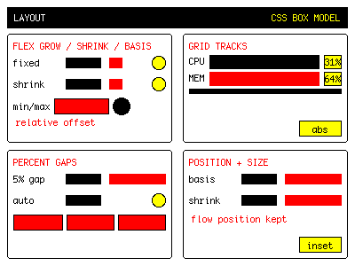
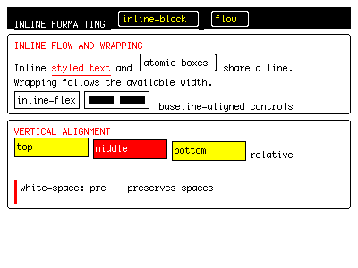
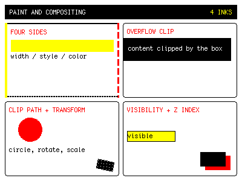
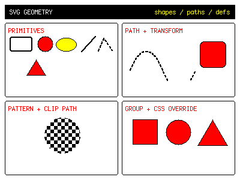
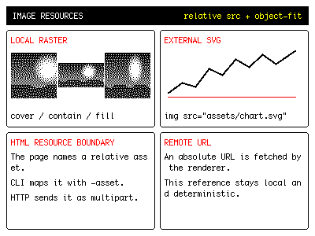
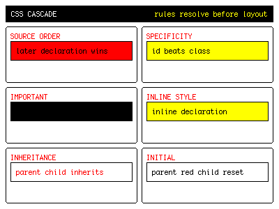
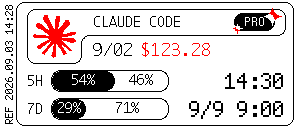

# Inkwire

A renderer for fixed-size e-paper pages written with HTML, CSS and SVG.

| | Gicisky | EPD-nRF5 |
|---|---|---|
| Firmware | factory | [replacement](https://github.com/tsl0922/EPD-nRF5), nRF51/nRF52 |
| Name | `PICKSMART`, `NEMR<mac8>` | `NRF_EPD_<mac4>` |
| Model from | advertisement | connection |
| Size | 212x104 … 960x640 | 400x300 … 880x528 |
| Inks | BW, BWR, BWRY | BW, BWR |

Markup follows Web layout conventions and implements a CSS subset for e-paper
panels. See [MARKUP.md](MARKUP.md) for its supported properties and rendering
differences.

## CLI

| Command | Purpose |
|---|---|
| `inkwire scan [-timeout 15s]` | List visible tags |
| `inkwire render (-size WxH \| -panel FAMILY:ID) [-o out.png] [-asset SRC=FILE] <page.html>` | Render to PNG |
| `inkwire compile [-o scene.json] [-asset SRC=FILE] <page.html>` | Write internal scene JSON |
| `inkwire measure (-size WxH \| -panel FAMILY:ID) [-json] [-asset SRC=FILE] <page.html>` | Output node layout |
| `inkwire push -device NAME [-family gicisky\|nrfepd] [-settle 30s] [-asset SRC=FILE] <page.html>` | Render and write |
| `inkwire mode -device NAME [-mode picture\|calendar\|clock] [-week-start sunday\|monday] [-settle 30s]` | EPD-nRF5 clock / calendar |
| `inkwire serve [-listen ADDR] [-assets DIR]` | Start the HTTP service |
| `inkwire help` | `-h`, `--help` |
| `inkwire version` | `-v`, `--version` |

### scan

Lists the tags currently visible to a scan. Use the reported name or address
with `-device`.

```bash
inkwire scan -timeout 10s
```

```
ADDRESS                                NAME           RSSI  BATT  FAMILY   MODEL           SIZE      PALETTE
FF:FF:92:94:38:61                      NEMR92943861    -50  3.0V  gicisky  EPD 2.9" BWR    296x128   BWR
C1:57:DD:3F:C1:F8                      NRF_EPD_C1F8    -62     -  nrfepd   ask on connect            not advertised
```

| Flag | Default | Meaning |
|---|---|---|
| `-timeout` | `15s` | How long the scan window lasts |

A scan identifies Gicisky by `0x5053` manufacturer data and EPD-nRF5 by service
UUID or name prefix.

Exits 1 when no tags are found.

### render

Renders a page to PNG.

```bash
inkwire render -size 296x128 -o preview.png page.html
```

```
wrote preview.png (296x128)
```

| Flag | Requirement | Meaning |
|---|---|---|
| `-o` | the page's path with `.png` | PNG output path |
| `-size` | one of `-size` or `-panel` is required | Lay out at an arbitrary `WxH` viewport |
| `-panel` | one of `-size` or `-panel` is required | Use a named panel's full size and check its inks |
| `-asset` | unset | Inject a local resource as `SRC=FILE`; repeatable |

`-size` and `-panel` are mutually exclusive. `-size` is the complete output
viewport and may be smaller or larger than any physical panel. `-panel` uses the
panel table's complete dimensions and ink palette.

```
$ inkwire render page.html
render needs -size WxH or -panel family:id
```

`-size` sets the complete layout and output size without consulting the panel table.

```bash
inkwire render -size 400x300 page.html
```

`-panel` takes the complete size and available inks from the named panel.

```bash
inkwire render -panel gicisky:0x0033 page.html
inkwire render -panel nrfepd:UC8176_420_BWR page.html
```

```
wrote page.png (296x128)
wrote page.png (400x300)
```

Report panel-incompatible content:

```bash
inkwire render -panel gicisky:0x0028 page.html
```

```
wrote page.png (296x128)
BW panel cannot show red ink at (10,10)
```

The preview is written even when the panel refuses the page. A bad panel or
size exits 2; a layout failure exits 1.

Page structure and CSS support are documented in [MARKUP.md](MARKUP.md).

### measure

Prints each node's layout box. Nothing is rendered.

```bash
inkwire measure -size 120x40 page.html
```

```
row         0,0    120x40
    text    0,11    40x17   wants 56x17
    text   44,11    76x17   wants 35x17

warning root.children[0] [text-clipped]: "LAST REF" does not fit 40x17: 16 pixels along the line cut off
```

| Flag | Requirement | Meaning |
|---|---|---|
| `-size` | one of `-size` or `-panel` is required | Lay out at an arbitrary `WxH` viewport |
| `-panel` | one of `-size` or `-panel` is required | Lay the page out at a named panel's full size |
| `-json` | off | Write the placements as JSON instead of a tree |
| `-asset` | unset | Inject a local resource as `SRC=FILE`; repeatable |

`wants` appears only when the requested size differs from the layout box.
An undersized box is not necessarily an error; `text-clipped` indicates that
content was clipped.

### push

Renders a page and writes it to a tag.

```bash
inkwire push -device NEMR92943861 page.html
```

```
writing to NEMR92943861 (e2ada7d1-187a-caea-21e4-d895f8240b62, gicisky)
pushing 9472 bytes (EPD 2.9" BWR 296x128 BWR)
tag requested 244 byte messages -> 240 byte blocks
upload complete, tag is refreshing
```

| Flag | Default | Meaning |
|---|---|---|
| `-device` | required | Advertised name (`NAME` column) or BLE address |
| `-family` | `auto` | Selects the device family; skips auto-detection |
| `-settle` | `30s` | EPD-nRF5 only: how long to stay connected after `REFRESH`; `0` leaves at once, see [Between writes](#between-writes) |
| `-asset` | unset | Inject a local resource as `SRC=FILE`; repeatable |

A page size that differs from the panel is laid out again for the panel and
reported as `size-mismatch`. An unsupported ink is drawn black and reported as
`unsupported-ink`, once per ink.

`push` obtains the target size and ink palette from the connected device; it does
not take `-size` or `-panel`.

Render warnings are printed with the write log; see [Warnings](#warnings).

### mode

Sets the clock or calendar mode on an EPD-nRF5 tag and synchronizes its time.

```bash
inkwire mode -device NRF_EPD_C1F8 -mode clock
```

```
connecting to NRF_EPD_C1F8 (C1:57:DD:3F:C1:F8)
firmware version 0x76
panel is UC8176_420_BWR 400x300 BWR
setting the clock to 2026-08-21 16:04:28 +0800 and the mode to clock
staying connected 30s while the panel refreshes; disconnecting now would cancel it
```

| Flag | Default | Meaning |
|---|---|---|
| `-device` | required | Advertised name or BLE address |
| `-mode` | `calendar` | `picture`, `calendar` or `clock` |
| `-week-start` | the tag's own setting | First column of a calendar week: `sunday` or `monday` |
| `-settle` | `30s` | How long to stay connected while the panel redraws; `0` leaves at once |

Only EPD-nRF5 supports this command. A Gicisky tag is refused:

```
NEMR92943861 (e2ada7d1-…, gicisky) is a gicisky tag, but the family asked for is nrfepd
```

`push` leaves a tag in `picture` mode; see [Clock and calendar](#clock-and-calendar).

### serve

Starts the HTTP service.

```bash
inkwire serve -listen 127.0.0.1:8080
```

```
listening on http://127.0.0.1:8080
```

| Flag | Default | Meaning |
|---|---|---|
| `-listen` | `127.0.0.1:8080` | Listen address, loopback only |
| `-assets` | `.` | Root directory for relative JSON-scene resources |

There is no authentication and write requests reach hardware directly. Only a
loopback address is accepted. Relative resources in JSON scenes are read below
the `-assets` directory; multipart pages must upload local resources. See
[Running the HTTP service](#running-the-http-service) for routes and error codes.

## Gicisky

| | |
|---|---|
| Panel | Detected from advertisement; 212x104 … 960x640, BW/BWR/BWRY |
| Orientation | landscape uses the profile size; portrait swaps width and height |
| Payload | model-specific planes, transforms and compression |
| GATT | service `FEF0`, control `FEF1`, data `FEF2` |

Manufacturer data (company ID `0x5053`):

```
byte   0        1        2   3        4
       id low   battery  firmware     id high
```

Model id = low 14 bits of `(data[4] << 8) | data[0]`. Names carry no model;
read manufacturer data before writing.

### Models

Read from the advertisement; no connection needed.

| ID | Name | Size | Inks | Transform and packing |
|---|---|---|---|---|
| `0x000B` | EPD 2.1" BWR | 212x104 | BWR | rotate 270°, mirror X |
| `0x0028` | EPD 2.9" BW | 296x128 | BW | rotate 90° |
| `0x002E` | EPD 2.9" BWRY | 296x128 | BWRY | rotate 90°, four colours two bits each |
| **`0x0033`** | **EPD 2.9" BWR** | **296x128** | **BWR** | rotate 90° |
| `0x004B` | EPD 4.2" BWR | 400x300 | BWR | |
| `0x004E` | EPD 4.2" BWRY | 400x300 | BWRY | four colours two bits each |
| `0x008B` | EPD 10.2" BWR | 960x640 | BWR | QuickLZ |
| `0x00A0` | TFT 2.1" BW | 250x132 | BW | TFT, rotate 90°, mirror X |
| `0x010B` | EPD 2.1" BWR | 250x128 | BWR | rotate 270°, mirror X |
| `0x012B` | EPD 7.5" BWR | 800x480 | BWR | mirror Y, invert, QuickLZ |
| `0x022B` | EPD 3.7" BWR | 240x416 | BWR | rotate 180°, mirror X, column compression |

`0x012B` on firmware `0x8101` uses column compression instead.

The model table comes from [hass-gicisky](https://github.com/eigger/hass-gicisky)
(MIT, © 2025 eigger). Only `0x0033` is hardware-verified; `inkwire scan` marks
the rest `unverified`:

```
FF:FF:92:94:38:61                      NEMR92943861    -50  3.0V  gicisky  EPD 4.2" BWR    400x300   BWR (unverified)
```

Unknown IDs are listed as `unrecognised model` and are not driven.

## EPD-nRF5

| | |
|---|---|
| GATT | service `62750001-d828-918d-fb46-b6c11c675aec`, rw+notify `…0002`, version `…0003` |
| Commands | `INIT=0x01` `REFRESH=0x05` `WRITE_IMAGE=0x30` `SET_TIME=0x20` |
| Planes | black + colour, row major, MSB first, set bit = white, colour inverted |
| Compression | firmware RLE; blank 400x300 plane 15000 → 232 bytes |


### Models

Read after connecting with `INIT`. A size mismatch triggers layout for the
actual panel and `size-mismatch`. An unsupported ink is drawn black and reported
as `unsupported-ink`.

| ID | Name | Size | Inks | Packing |
|---|---|---|---|---|
| `0x01` | UC8176_420_BW | 400x300 | BW | planes |
| `0x02` | SSD1619_420_BWR | 400x300 | BWR | planes |
| **`0x03`** | **UC8176_420_BWR** | **400x300** | **BWR** | planes |
| `0x04` | SSD1619_420_BW | 400x300 | BW | planes |
| `0x06` | UC8179_750_BW | 800x480 | BW | planes |
| `0x07` | UC8179_750_BWR | 800x480 | BWR | planes |
| `0x0a` | SSD1677_750_HD_BW | 880x528 | BW | planes |
| `0x0b` | SSD1677_750_HD_BWR | 880x528 | BWR | planes |
| `0x10` | UC8179_583_BWR | 648x480 | BWR | planes |
| `0x11` | UC8179_583_BW | 648x480 | BW | planes |
| `0x08` `0x09` `0x0e` `0x0f` | UC8159 | 640x384 / 600x448 | BW/BWR | nibbles, **unimplemented** |
| `0x05` `0x0c` `0x0d` | JD796xx | 400x300 / 800x480 / 648x480 | BWRY | **unimplemented** |

`0x03` verified; others print `unverified`:

```
panel is UC8179_750_BWR 800x480 BWR (unverified), link carries 244 bytes and can decompress
```

Unimplemented packings are refused, not attempted.

### Clock and calendar

| Mode | Redraw |
|---|---|
| `picture` | none |
| `calendar` | daily at `00:00:00` |
| `clock` | every minute |

`push` resets the tag to `picture`. `mode` restores it and synchronizes the time:

```bash
inkwire mode -device NRF_EPD_C1F8 -mode clock
```

`-week-start` unset leaves the tag's own value.

## The Bluetooth link


### Signal and distance

RSSI depends on the transmitter, antennas, path and receiver. The table is for
the test adapter only.

Test conditions: Realtek RTL8761BU dongle (Debian, USB `0bda:8771`, Bluetooth
5.1, integrated antenna, USB 2.0 full speed); tags upright with clear line of sight.

| Distance | Gicisky | EPD-nRF5 | Pushes |
|---|---|---|---|
| 1 m | −66 dBm | −68 dBm | 4/4 |
| 2 m | −74 dBm | −78 dBm | 2/2 |
| 3 m | −76 dBm | −80 dBm | 2/2 |
| 5 m | −80 dBm | −86 dBm | 2/2 |


### Between writes

Leave ≥45 s between writes to one tag. Connections are refused while refreshing;
26 s failed in testing.

`-settle` controls how long the connection remains open after a write.
Disconnecting early cancels the draw. A cancelled draw produces an abnormal
image; its cause cannot be verified.

A 4.2" 400x300 BWR tag required 90 s in testing; 30 s was insufficient. The
duration depends on panel refresh time, not page content.

`mode` also uses `-settle`. Setting the time triggers a redraw; an insufficient
duration cancels it.

`-settle 0` disconnects after the write and cancels the draw. Omit it for the
30 s default. Negative values are refused.

### Connection failures

| What it looks like | Where |
|---|---|
| `le-connection-abort-by-local` | Opening the connection |
| The panel does not say what it is within 5 s | After `INIT`, EPD-nRF5 only |
| `ATT error: 0x0e` | A random frame mid-transfer |

A failure is retried three times, two seconds apart. The command reports an
error after all attempts fail.

Silence between advertising windows is normal. A missed scan does not confirm
the tag is absent.

## Running the HTTP service

```bash
inkwire serve -listen 127.0.0.1:8080
```

Routes match the same-named CLI subcommands.

| Route | Command | What it does |
|---|---|---|
| `GET /v1/scan` | `inkwire scan` | Lists the tags a scan can currently see |
| `POST /v1/render` | `inkwire render` | Renders locally and returns JSON containing a base64 PNG preview |
| `POST /v1/push` | `inkwire push` | Renders a page and writes it to a tag |
| `POST /v1/mode` | `inkwire mode` | Sets the EPD-nRF5 clock or calendar |

Every write route requires `?device=`. The service does not select a tag.

`/v1/render` requires exactly one of `?size=WxH` or `?panel=family:id`. The
request target supplies the complete viewport; the HTML root size does not
replace it.

```bash
curl http://127.0.0.1:8080/v1/scan

curl -F 'page=@examples/markup_quickstart/page.html;type=text/html' \
  'http://127.0.0.1:8080/v1/render?size=296x128'

curl -F 'page=@examples/markup_quickstart/page.html;type=text/html' \
  'http://127.0.0.1:8080/v1/render?panel=gicisky:0x0033'

curl -F 'page=@examples/markup_quickstart/page.html;type=text/html' \
  'http://127.0.0.1:8080/v1/push?device=NRF_EPD_C1F8'

curl -X POST 'http://127.0.0.1:8080/v1/mode?device=NRF_EPD_C1F8&mode=clock'
```

| Query parameter | Used by | Meaning |
|---|---|---|
| `size` | render | Lay out at an arbitrary `WxH` viewport |
| `panel` | render | Use a named panel's full size and check its inks |
| `device` | push, mode | Advertised name or BLE address, required |
| `family` | push | Selects the device family; skips auto-detection |
| `mode` | mode | `picture`, `calendar` or `clock`; `calendar` by default |
| `week-start` | mode | `sunday` or `monday`; unset leaves the tag's own setting |

`/v1/render` and `/v1/push` return the full JSON `report`; `/v1/push` and
`/v1/mode` also return device status. A `?panel=` rejection returns
`unprocessable-scene` with `pngBase64` still in the body.


### Warnings

Non-fatal.

| `code` | Meaning |
|---|---|
| `text-clipped` | Content exceeds its layout box |
| `layout-overflow` | Children exceed the container on the main axis |
| `empty-layout` | No drawable area remains |
| `missing-runes` | Font lacks glyphs |
| `size-mismatch` | Page size differs from panel; relaid out and clipped to panel |
| `unsupported-ink` | Unsupported ink, drawn black; one warning per ink |
| `unsupported-declaration` | Unsupported CSS property or value, ignored |
| `unsupported-at-rule` | Unsupported at-rule, ignored |
| `unresolved-drawing` | SVG has no size or drawable content |
| `unresolved-image` | Image cannot be read |
| `no-stylesheet` | Page has no style source |
| `unresolved-stylesheet` | Stylesheet cannot be read |
| `duplicate-stylesheet` | The same stylesheet arrived twice; read once |
| `over-constrained` | Both edges and a size on one axis; the end edge dropped, as CSS drops it |
| `unsupported-selector` | Selector cannot be parsed; rule skipped |
| `unreadable-rule` | Rule has a syntax error; skipped |
| `substituted-font-size` | Font or size unavailable; nearest value used |

### Errors

| `code` | Status | Meaning |
|---|---|---|
| `unsupported-media-type` | 415 | `Content-Type` is not `application/json` or `multipart/form-data` |
| `invalid-request` | 400 | Missing `device` or render target, invalid parameter value or malformed multipart |
| `request-too-large` | 413 | Over the size limit |
| `invalid-scene` | 422 | Will not decode or render |
| `invalid-page` | 422 | The `page` part cannot be compiled |
| `unprocessable-scene` | 422 | Renders successfully, but cannot be packed for that panel |
| `render-failed` | 500 | PNG encoding failed |
| `device-busy` | 409 | Adapter in use |
| `device-identify-failed` | 502 | Unreachable device, wrong family, unknown model or scan failure |
| `push-failed` | 502 | Tag error or connection failure |
| `device-timeout` | 504 | The complete device operation exceeded its family budget |
| `scan-failed` | 502 | Scan failed |

### Concurrency

One adapter permits one session at a time. Concurrent writes return the current
holder's status:

```json
{
  "error": "device PICKSMART is being written",
  "code": "device-busy",
  "status": {
    "device": "PICKSMART",
    "state": "pushing",
    "since": "2026-08-13T02:41:07Z"
  }
}
```

`status` accompanies every write result.

| Step | Measured |
|---|---|
| Scan | 4.3 – 11.5 s |
| Connect + first reply | 4.3 – 7.8 s |
| Per block | ~105 ms |
| One Gicisky write | 14.6 – 20.5 s |

Defaults: scan 15 s, reply 5 s, retry interval 2 s, three attempts.

## Image sources

HTML references images through `img src`. `src` may be an HTTP/HTTPS URL or a
relative path. `.png`, `.jpg` and `.jpeg` are bitmaps; `.svg` is an external
drawing.

```html


```

SVG `viewBox` coordinates are mapped to the element box with the browser
default `xMidYMid meet`; fractional scaling, non-zero origins and signed
axis transforms are supported. The SVG viewport clips its contents. Fill and
stroke colors must be panel inks (`black`, `white`, `red`, `yellow`, or an
equivalent hexadecimal form); other colors are reported and skipped. Open
lines, polylines and paths support `stroke-linecap: butt|round|square`; path
joins support `stroke-linejoin: miter|round|bevel`.
`<use href="#id">` and `xlink:href` reuse a named supported element or group from the same SVG.

The CLI injects local resources with repeatable `-asset SRC=FILE` flags:

```bash
inkwire render \
     -size 296x128 \
     -asset assets/portrait.png=photos/portrait.png \
     -asset assets/chart.svg=charts/chart.svg \
     page.html
```

When no mapping is given, the CLI still reads relative resources beside the
page. HTTP uses multipart: `page` is the HTML document; each local resource is a
binary file part whose field name exactly matches `src`, including any directory
prefix. HTTP/HTTPS resources need no file part.

A client-local path is not visible to the service; local resources referenced by
an HTTP page must be uploaded with the request.

```bash
curl -F 'page=@page.html;type=text/html' \
     -F 'assets/portrait.png=@assets/portrait.png;type=image/png' \
     -F 'assets/chart.svg=@assets/chart.svg;type=image/svg+xml' \
     'http://127.0.0.1:8080/v1/render?size=296x128'
```

`link` `href` follows the same relative-resource rule, and `stylesheet` may be sent as its own part.

| Limit | |
|---|---:|
| Page | 16 MiB |
| One asset | 32 MiB |
| Request | 64 MiB |
| Asset count | 32 |
| Rendered page or decoded image | 16,777,216 pixels |

## Examples

### Markup capabilities

| Page | Size | Covers |
|---|---:|---|
| [layout](examples/markup_capabilities/layout.html) | 400x300 | box model, flex, grid, sizing, positioning |
| [inline](examples/markup_capabilities/inline.html) | 400x300 | inline flow, atomic boxes, vertical alignment |
| [paint](examples/markup_capabilities/paint.html) | 400x300 | inks, borders, clipping, visibility, transforms |
| [svg](examples/markup_capabilities/svg.html) | 400x300 | SVG primitives, paths, patterns, groups |
| [resources](examples/markup_capabilities/resources.html) | 400x300 | local images, external SVG, object-fit |
| [cascade](examples/markup_capabilities/cascade.html) | 400x300 | source order, specificity, importance, inheritance |
| [potrace](examples/markup_capabilities/potrace.html) | 500x500 | imported SVG with viewBox and signed transforms |

### Scenarios and tools

| Page | Size |
|---|---|
| [markup_quickstart](examples/markup_quickstart/page.html) | 296x128 |
| [panel_check](examples/panel_check/): [primitives](examples/panel_check/primitives.html) [polarity](examples/panel_check/polarity.html) | 400x300 |
| [fridge](examples/fridge/page.html) | 400x300 |
| [claude_usage](examples/claude_usage/page.html) — Claude Code usage snapshot | 296x128 |
| [card_showcase](examples/card_showcase/page.html) | 296x128 |
| [cookbook](examples/cookbook/main.go) — display API | 308x944 |
| [gallery](examples/gallery/main.go) — image resources | 508x392 |

Regenerate reference images: `INKWIRE_UPDATE_REFERENCES=1 go test ./...`

<table>
  <tr>
    <td><a href="examples/markup_capabilities/layout.html"></a></td>
    <td><a href="examples/markup_capabilities/inline.html"></a></td>
  </tr>
  <tr>
    <td><a href="examples/markup_capabilities/paint.html"></a></td>
    <td><a href="examples/markup_capabilities/svg.html"></a></td>
  </tr>
  <tr>
    <td><a href="examples/markup_capabilities/resources.html"></a></td>
    <td><a href="examples/markup_capabilities/cascade.html"></a></td>
  </tr>
  <tr>
    <td><a href="examples/card_showcase/page.html"></a></td>
    <td><a href="examples/fridge/page.html"></a></td>
  </tr>
  <tr>
    <td><a href="examples/claude_usage/page.html"></a></td>
  </tr>
</table>

## Reference

- https://github.com/atc1441/ATC_GICISKY_ESL — protocol
- https://atc1441.github.io/ATC_GICISKY_Paper_Image_Upload.html — upload tool
- https://github.com/tinygo-org/bluetooth — Go BLE
- https://github.com/fpoli/gicisky-tag — Python
- https://github.com/eigger/hass-gicisky — Home Assistant
- https://github.com/tsl0922/EPD-nRF5 — EPD-nRF5 firmware

[中文](README.zh-CN.md)
