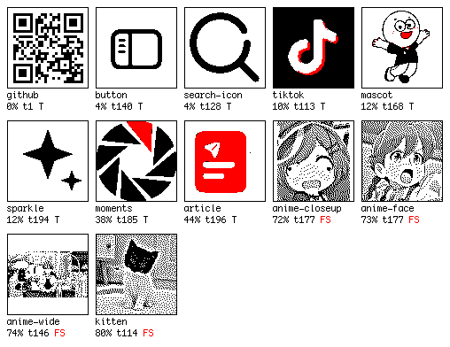
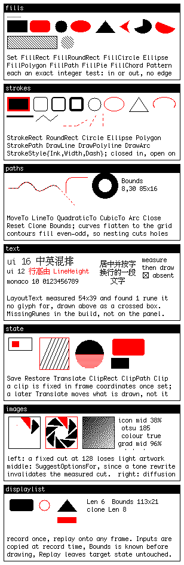

# Inkwire

使用 Scene Schema 驱动的 Gicisky 电子纸标签

## 设备信息

| 项目 | 当前支持 |
|---|---|
| 设备 |  Gicisky / PICKSMART 电子纸标签 |
| 广播名称 | `PICKSMART`、`NEMR<MAC后八位>` |
| 默认 BLE Public 地址 | `FF:FF:92:94:38:61` |
| 屏幕 | 296x128 像素，黑、白、红三色，无灰度 |
| 页面方向 | 横屏 296x128；顺时针或逆时针竖屏 128x296 |
| 图像数据 | 黑白平面和红色平面，共 9472 字节 |
| BLE GATT | Service `FEF0`，控制特征 `FEF1`，数据特征 `FEF2` |


## 命令行

| 命令 | 用途 |
|---|---|
| `./inkwire render [-o preview.png] <scene.json>` | 渲染 PNG 预览；未指定 `-o` 时与 JSON 同名 |
| `./inkwire encode [-o payload.bin] <scene.json>` | 生成设备 payload；未指定 `-o` 时与 JSON 同名 |
| `./inkwire push [-device MAC-or-name] <scene.json>` | 渲染并写入设备 |
| `./inkwire scan [-timeout 15s]` | 列出附近所有标签，并识别每个的型号、分辨率、颜色和电压 |
| `./inkwire serve [-listen address] [-device MAC-or-name] [-assets directory]` | 启动 HTTP 服务 |
| `./inkwire push-payload [MAC-or-name] <payload.bin>` | 写入已经编码的 payload |

预览并写入设备：

```bash
./inkwire render -o preview.png page.json
./inkwire push -device PICKSMART page.json
```

`-device` 支持 BLE 地址或广播名称。默认地址 `FF:FF:92:94:38:61`；

### 标签识别

标签在 BLE 广播的 manufacturer data 里报告自己的型号，厂商 ID `0x5053`（ASCII `PS`，PICKSMART）：

```
byte   0       1        2   3        4
       id 低位  电池     固件版本      id 高位
```

型号 ID 取 `(data[4] << 8) | data[0]` 的低 14 位。广播名不携带型号信息——`NEMR` 后面是 MAC 后八位，不同尺寸的标签名字格式相同，而且有些广播包里名字直接是空的。**因此识别一律以 manufacturer data 为准。**

```
$ ./inkwire scan
ADDRESS                                NAME           RSSI  BATT  MODEL           SIZE      PALETTE
e2ada7d1-187a-caea-21e4-d895f8240b62   NEMR92943861    -50  3.0V  EPD 2.9" BWR    296x128   BWR
```

型号表覆盖 11 个型号（212×104 到 960×640，BW / BWR / BWRY），移植自 [hass-gicisky](https://github.com/eigger/hass-gicisky)（MIT，© 2025 eigger）。**其中只有 `0x0033`（2.9" BWR）经过实机验证**，其余按上游数据采信，在 `scan` 输出中标注 `unverified`。

认不出型号的标签仍会被列出，但标记为不可驱动——此时页面尺寸只能靠猜，而猜错就是往面板写入形状错误的数据。


## HTTP

启动服务：

```bash
./inkwire serve \
  -listen 127.0.0.1:8080 \
  -device PICKSMART
```

| 请求 | 返回值 |
|---|---|
| `POST /v1/render` | PNG，`Content-Type: image/png` |
| `POST /v1/encode` | 9472 字节设备 payload，`Content-Type: application/octet-stream` |
| `POST /v1/display` | 写入设备后的 JSON 结果 |
| `GET /v1/devices` | 扫描并列出附近所有标签及其型号信息 |

`-listen` 只接受回环地址。

发送纯 JSON：

```bash
curl \
  -H 'Content-Type: application/json' \
  --data-binary @page.json \
  http://127.0.0.1:8080/v1/render \
  -o preview.png

curl \
  -H 'Content-Type: application/json' \
  --data-binary @page.json \
  http://127.0.0.1:8080/v1/encode \
  -o payload.bin

curl \
  -H 'Content-Type: application/json' \
  --data-binary @page.json \
  'http://127.0.0.1:8080/v1/display?device=PICKSMART'
```

响应报告位于 `X-Inkwire-Warnings`、`X-Inkwire-Missing-Runes` 和 `X-Inkwire-Image-Decisions`。

### 渲染警告

警告不会阻止渲染。

| `code` | 含义 |
|---|---|
| `text-clipped` | 文字放不进它的框，字符或整行被裁掉 |
| `layout-overflow` | 子节点在主轴上需要的空间超过容器 |
| `empty-layout` | 内边距或尺寸使可绘制区域为零，该节点没有画出任何东西 |
| `missing-runes` | 字库里没有这些字符 |

### 错误码


| `code` | 状态码 | 含义 |
|---|---|---|
| `unsupported-media-type` | 415 | `Content-Type` 既不是 JSON 也不是 multipart |
| `invalid-request` | 400 | multipart 结构有问题 |
| `request-too-large` | 413 | 场景或资源超出体积上限 |
| `invalid-scene` | 422 | 场景文档无法解码或渲染 |
| `unprocessable-scene` | 422 | 场景渲染成功但无法编码成设备 payload |
| `render-failed` | 500 | PNG 编码失败 |
| `device-busy` | 409 | 蓝牙适配器正在写另一次请求 |
| `push-failed` | 502 | 标签响应了错误，或连接失败 |
| `device-timeout` | 504 | 重试用尽仍未拿到标签响应 |

### 写入的并发与超时

`/v1/display` 是互斥的——**跨设备互斥，不只是同一个标签**。第二个请求不排队，立刻返回 409 并带上当前占用者的状态：

```json
{
  "error": "device PICKSMART is being written",
  "code": "device-busy",
  "status": {
    "device": "PICKSMART",
    "state": "pushing",
    "since": "2026-08-13T02:41:07Z"
  }
}
```

`status` 也出现在成功和失败的响应里，记录上一次写入的时间、结果和字节数。

超时的取值来自真机实测（2026-08-13，RSSI -47 到 -54）：

| 步骤 | 实测 | 说明 |
|---|---|---|
| 扫描发现标签 | 4.3 – 11.5 秒 | 取决于标签的广播间隔，波动最大，也最不可控 |
| 连接、发现服务、首次应答 | 4.3 – 7.8 秒 | 含固定的 2 秒通知就绪等待 |
| 每个数据块往返 | 约 105 毫秒 | 40 块，最后一个"开始刷新"的应答同样是 105 毫秒 |
| **一次完整写入** | **14.6 – 20.5 秒** | |

因此扫描超时保持 15 秒——低于这个值会把正常的标签判成失败。应答超时 5 秒，重试间隔 2 秒，最多 3 次。

`/v1/display` 的总预算是 45 秒：足够覆盖最慢的一次正常写入，**外加一次完全落空的扫描和重试**。超过就返回 `device-timeout`，说明重试没能让标签应答。无论成功还是失败都会立刻释放适配器，一个坏标签不会卡住服务。

## 图片资源与路径

图片节点通过 `source` 引用资源。`source` 的解析方式取决于场景文档从命令行读取，还是通过 HTTP 提交。

### 命令行：相对场景文档

使用 `render`、`encode` 或 `push` 读取场景文档时，相对路径以场景文档所在目录为起点，与执行命令时所在的目录无关。

```text
inkwire-workspace/
├── inkwire
├── scenes/
│   ├── dashboard/
│   │   ├── page.json
│   │   └── assets/
│   │       └── portrait.png
│   └── weather/
│       └── page.json
└── output/
```

`scenes/dashboard/page.json` 中的图片节点写作：

```json
{
  "type": "image",
  "source": "assets/portrait.png",
  "processing": "auto"
}
```

场景文档一旦被找到，`source` 就会相对于它解析为 `scenes/dashboard/assets/portrait.png`：

```bash
./inkwire render -o output/dashboard.png scenes/dashboard/page.json
```

命令行模式也接受图片的绝对路径、`file:` URL 和 Base64 Data URL。

### HTTP：相对 assets 根目录

HTTP 请求中的场景文档没有本地文件位置。使用服务器上的图片时，先通过 `-assets` 指定唯一的资源根目录；所有相对 `source` 都从该目录开始解析。

```text
inkwire-service/
├── inkwire
├── scenes/
│   └── dashboard.json
├── public-assets/
│   ├── portraits/
│   │   └── portrait.png
│   ├── icons/
│   └── backgrounds/
└── output/
```

在 `inkwire-service` 目录启动服务：

```bash
./inkwire serve -assets ./public-assets
```

场景中的 `source` 写作：

```json
{
  "type": "image",
  "source": "portraits/portrait.png",
  "processing": "auto"
}
```

服务器会读取 `public-assets/portraits/portrait.png`。它不会从 `scenes/dashboard.json` 所在目录查找，也不接受绝对路径或通过 `..` 离开 `public-assets`。

```bash
curl \
  -H 'Content-Type: application/json' \
  --data-binary @scenes/dashboard.json \
  http://127.0.0.1:8080/v1/render \
  -o output/dashboard.png
```

### HTTP：随请求上传

不希望服务器预先保存图片时，可以使用 multipart。此时 `source` 是 multipart 文件字段名，不是本地路径。

```text
request-files/
├── page.json
├── photos/
│   └── portrait.png
├── icons/
└── output/
```

`page.json` 中使用字段名 `portrait`：

```json
{
  "version": 1,
  "root": {
    "type": "image",
    "source": "portrait",
    "processing": "auto"
  }
}
```

上传时令文件字段名与 `source` 完全一致：

```bash
curl \
  -F 'scene=@request-files/page.json;type=application/json' \
  -F 'portrait=@request-files/photos/portrait.png;type=image/png' \
  http://127.0.0.1:8080/v1/render \
  -o request-files/output/preview.png
```

`scene` 固定用于 Scene Schema JSON 文档，其他文件字段均作为图片资源。同名上传资源优先于 `-assets` 目录中的文件，并且只在本次请求中有效。

请求限制：

| 项目 | 限制 |
|---|---:|
| Scene Schema JSON | 16 MiB |
| 单个图片资源 | 32 MiB |
| 整个 multipart 请求 | 64 MiB |
| 图片资源数量 | 32 |

## Scene Schema 快速开始

坐标和尺寸均使用整数像素。横屏为 296x128，顺时针或逆时针竖屏为 128x296。

```json
{
  "version": 1,
  "orientation": "landscape",
  "background": "white",
  "root": {
    "type": "absolute",
    "clip": true,
    "children": [
      {
        "bounds": {"x": 4, "y": 4, "width": 288, "height": 24},
        "node": {
          "type": "rectangle",
          "radius": 4,
          "fill": "black"
        }
      },
      {
        "bounds": {"x": 10, "y": 8, "width": 276, "height": 16},
        "node": {
          "type": "text",
          "runs": [
            {"text": "INKWIRE ", "font": "monaco", "size": 12, "ink": "white"},
            {"text": "23.5℃", "font": "ui", "size": 14, "ink": "red"}
          ]
        }
      },
      {
        "bounds": {"x": 12, "y": 42, "width": 272, "height": 72},
        "node": {
          "type": "text",
          "wrap": "runes",
          "lineHeight": 16,
          "runs": [
            {"text": "今天的电子纸页面由 JSON 直接生成。", "font": "ui", "size": 14, "ink": "black"}
          ]
        }
      }
    ]
  }
}
```

```bash
./inkwire render -o preview.png page.json
./inkwire push page.json
```

示例的实际文件和渲染结果：

- [page.json](examples/schema_quickstart/page.json)
- [schema_quickstart.png](examples/schema_quickstart/schema_quickstart.png)


## 通用参数

### 页面

| 字段 | 类型 | 可选值或用途 | 默认值 |
|---|---|---|---|
| `version` | integer | 当前必须为 `1` | 必填 |
| `orientation` | string | `landscape`、`portraitClockwise`、`portraitCounterClockwise` | `landscape` |
| `size` | size | 自定义预览尺寸；写入设备时不要设置 | 设备尺寸 |
| `background` | ink | `white`、`black`、`red` | `white` |
| `root` | node | 页面根节点 | 空页面 |

### 基本值

```json
{
  "size": {"width": 100, "height": 40},
  "point": {"x": 10, "y": 5},
  "rect": {"x": 10, "y": 5, "width": 100, "height": 40}
}
```

`ink` 可为 `black`、`white` 或 `red`。省略可选颜色时默认为 `black`。

描边对象：

```json
{
  "ink": "black",
  "width": 2,
  "dash": [4, 2],
  "dashOffset": 0
}
```

| 字段 | 类型 | 用途 | 默认值 |
|---|---|---|---|
| `ink` | ink | 描边颜色 | `black` |
| `width` | integer | 描边宽度，必须大于 `0` | 必填 |
| `dash` | integer[] | 交替的实线、空白长度，每项必须大于 `0` | 实线 |
| `dashOffset` | integer | 虚线起始偏移 | `0` |

所有节点都需要 `type`。

`size: {width, height}` 给节点定尺寸，在 `row`、`column`、`grid`、`stack`、`padding` 和裁剪节点里有效；不写就按内容自动测量。

`absolute` 的子节点用 `bounds` 定尺寸，`anchored` 的子节点用四边距离定尺寸。在这两者里给子节点写 `size` 会报错。

### 长度

表格里标注为 length 的字段有三种写法：

| 写法 | 含义 |
|---|---|
| `64` | 像素 |
| `"25%"` | 容器对应轴尺寸的百分比 |
| `"calc(100% - 12px)"` | 百分比加减一个固定像素数，空格可有可无 |

```json
{"basis": 64, "cross": "25%", "maxMain": "calc(100% - 12px)"}
```

`calc` 只有"百分比 ± 像素数"一种形式，两项都不能省。

`0` 是一个长度，字段省略才是自动。在 `anchored` 上 `"right": 0` 贴右边缘，不写 `right` 则不约束右边。

**表示距离的字段可以写负数**，用来让内容出血到容器外面：`anchored` 的 `top` / `right` / `bottom` / `left`、`clipShape` 里 `inset` 的四个值、`circle` 和 `ellipse` 的 `center`、`polygon` 的 `points`。三种写法都支持负号：

```json
{"left": -6, "right": "-10%", "top": "calc(0% - 6px)"}
```

表示尺寸的字段不能为负，写了会报错——`basis`、`cross`、`width`、`height`、`minMain` 一族、grid 轨道、`radius`、`corner` 都属于这一类。

想让一个节点参与"内容有多大"的测量，给它写像素值。百分比和 `fr` 要等容器尺寸出来才有值，在测量阶段不计入。


## 布局节点

### absolute

按指定矩形放置子节点：

```json
{
  "type": "absolute",
  "clip": true,
  "children": [
    {
      "bounds": {"x": 4, "y": 4, "width": 100, "height": 20},
      "node": {"type": "rectangle", "fill": "black"}
    }
  ]
}
```

| 字段 | 类型 | 用途 | 默认值 |
|---|---|---|---|
| `size` | size | 首选尺寸 | 内容尺寸 |
| `clip` | boolean | 是否裁掉节点边界之外的子内容 | `false` |
| `children[].bounds` | rect | 子节点相对坐标和尺寸 | 必填 |
| `children[].node` | node | 子节点 | 必填 |

### row / column

`row` 从左向右排列，`column` 从上向下排列：

```json
{
  "type": "row",
  "gap": 4,
  "mainAlign": "start",
  "crossAlign": "center",
  "children": [
    {
      "basis": 64,
      "node": {"type": "text", "runs": [{"text": "LEFT"}]}
    },
    {
      "grow": 1,
      "node": {"type": "text", "align": "end", "runs": [{"text": "RIGHT"}]}
    }
  ]
}
```

| 字段 | 类型 | 可选值或用途 | 默认值 |
|---|---|---|---|
| `size` | size | 首选尺寸 | 内容尺寸 |
| `gap` | integer | 子节点间距，不得为负 | `0` |
| `mainAlign` | string | `start`、`center`、`end` | `start` |
| `crossAlign` | string | `stretch`、`start`、`center`、`end` | `stretch` |
| `children[].basis` | length | 主轴基础尺寸，不得为负 | 节点测量尺寸 |
| `children[].cross` | length | 交叉轴尺寸；写了就不再被 `stretch` 拉伸 | 由 `crossAlign` 决定 |
| `children[].grow` | integer | 剩余空间分配权重，不得为负 | `0` |
| `children[].minMain` / `maxMain` | length | 主轴尺寸上下限 | 无限制 |
| `children[].minCross` / `maxCross` | length | 交叉轴尺寸上下限 | 无限制 |
| `children[].alignSelf` | string | `stretch`、`start`、`center`、`end`，覆盖容器的 `crossAlign` | 跟随容器 |
| `children[].ratio` | number | 宽高比，由主轴尺寸推出交叉轴尺寸 | `0`，不启用 |
| `children[].node` | node | 子节点 | 必填 |


### grid

多行要对齐同一列时用 `grid`。`auto` 轨道会跨所有行量一次，不用手写列宽。

```json
{
  "type": "grid",
  "columns": ["auto", "1fr", "auto"],
  "rows": [15, 15],
  "columnGap": 5,
  "rowGap": 3,
  "children": [
    {"node": {"type": "text", "runs": [{"text": "/data"}]}},
    {"node": {"type": "rectangle", "stroke": {"ink": "black", "width": 1}}},
    {"node": {"type": "text", "align": "end", "runs": [{"text": "1180G"}]}},
    {"column": 1, "columnSpan": 3, "node": {"type": "spacer"}}
  ]
}
```

轨道有三种写法，和 CSS 一致：

| 写法 | 含义 |
|---|---|
| `"auto"` | 取这一轨里最宽（或最高）内容的尺寸 |
| `"2fr"` | 按整数份额瓜分其他轨道用剩的空间 |
| `40`、`"25%"`、`"calc(100% - 8px)"` | 直接写死；轨道就是 length，写法完全一致 |

| 字段 | 类型 | 可选值或用途 | 默认值 |
|---|---|---|---|
| `size` | size | 首选尺寸 | 内容尺寸 |
| `columns` / `rows` | track[] | 轨道定义 | 单轨 `auto` |
| `columnGap` / `rowGap` | integer | 轨道间距，不得为负 | `0` |
| `alignItems` | string | `stretch`、`start`、`center`、`end`，纵向摆放 | `stretch` |
| `justifyItems` | string | 同上，横向摆放 | `stretch` |
| `children[].column` / `row` | integer | 从 1 开始的线号，`0` 表示放进下一个空格子 | `0` |
| `children[].columnSpan` / `rowSpan` | integer | 跨几轨 | `1` |
| `children[].alignSelf` / `justifySelf` | string | 覆盖 `alignItems` / `justifyItems` | 跟随容器 |
| `children[].node` | node | 子节点 | 必填 |


### anchored

按到各边的距离摆放子节点，可以叠放。距离用百分比或要等容器排完才算得出的，用 `anchored`；坐标写文档时就确定的，用 `absolute`。

```json
{
  "type": "anchored",
  "children": [
    {"left": "50%", "top": 0, "width": 40, "height": 12,
     "node": {"type": "rectangle", "fill": "black"}},
    {"right": 0, "bottom": 0, "width": 20, "height": 20, "layer": 1,
     "node": {"type": "rectangle", "fill": "red"}}
  ]
}
```

| 字段 | 类型 | 用途 | 默认值 |
|---|---|---|---|
| `size` | size | 首选尺寸 | 容器给的尺寸 |
| `children[].top` / `right` / `bottom` / `left` | length | 到对应边的距离 | 不约束该边 |
| `children[].width` / `height` | length | 尺寸 | 由两侧距离推出 |
| `children[].layer` | integer | 数值大的后画，压在上面；相同则按文档顺序 | `0` |
| `children[].node` | node | 子节点 | 必填 |

同一轴上给了两侧距离就不要再给尺寸（`left` + `right` + `width`），三者同时出现会报错。被 `anchored` 摆放的子节点不影响容器的测量尺寸。


### transformed

```json
{
  "type": "transformed",
  "scale": 2,
  "turns": 1,
  "child": {"type": "text", "runs": [{"text": "42"}]}
}
```

| 字段 | 类型 | 用途 | 默认值 |
|---|---|---|---|
| `size` | size | 首选尺寸 | 变换后的内容尺寸 |
| `scale` | integer | 放大倍数，不得为负 | `1` |
| `turns` | integer | 顺时针转过的四分之一圈数 | `0` |
| `child` | node | 子节点 | 必填 |

子节点拿到的是变换前的框：`scale` 为 2 时它只有一半的地方，画出来是原尺寸。放大倍数和圈数都只能取整数。


### stack / padding / spacer

`stack` 将所有子节点放在同一矩形中，数组后面的节点覆盖前面的节点：

```json
{
  "type": "stack",
  "children": [
    {"type": "rectangle", "fill": "white", "stroke": {"ink": "black", "width": 1}},
    {"type": "text", "align": "center", "verticalAlign": "middle", "runs": [{"text": "OK"}]}
  ]
}
```

`padding` 给一个子节点增加四边留白：

```json
{
  "type": "padding",
  "insets": {"top": 4, "right": 8, "bottom": 4, "left": 8},
  "child": {"type": "text", "runs": [{"text": "PAD"}]}
}
```

四个 `insets` 值均不得为负。`spacer` 用于占位：

```json
{"type": "spacer", "size": {"width": 8, "height": 8}}
```

## 文字节点

```json
{
  "type": "text",
  "align": "start",
  "verticalAlign": "top",
  "wrap": "none",
  "lineHeight": 14,
  "runs": [
    {"text": "温度 ", "font": "hzk", "size": 14, "ink": "black"},
    {"text": "23.5", "font": "monaco", "size": 14, "ink": "red"},
    {"text": "℃", "font": "hzk", "size": 14, "ink": "red"}
  ]
}
```

| 字段 | 类型 | 可选值或用途 | 默认值 |
|---|---|---|---|
| `size` | size | 文字框首选尺寸 | 测量尺寸 |
| `runs` | run[] | 按顺序绘制的文字片段 | 空 |
| `align` | string | `start`、`center`、`end` | `start` |
| `verticalAlign` | string | `top`、`middle`、`bottom` | `top` |
| `wrap` | string | `none`、`runes` | `none` |
| `lineHeight` | integer | 行高；`0` 使用字体行高，不得为负 | `0` |
| `runs[].text` | string | 原样显示的内容 | 空字符串 |
| `runs[].font` | string | `ui`、`hzk`、`monaco` | `ui` |
| `runs[].size` | integer | 字体支持的固定字号 | `12` |
| `runs[].ink` | ink | 文字颜色 | `black` |

可用字体和字号：

| 字体 | 内置字号 | 整数倍放大 | 用途 |
|---|---|---|---|
| `ui` | `12`、`14`、`16` | `24`、`28`、`32`、`36`、`42`、`48` | 中英文、数字和常用符号混排 |
| `hzk` | `12`、`14`、`16` | `24`、`28`、`32`、`36`、`42`、`48` | 中文点阵字 |
| `monaco` | `10`、`12`、`14`、`16` | `20`、`24`、`28`、`30`、`32`、`36`、`42`、`48` | 英文、数字和 ASCII 符号 |

**字号是枚举，不是范围。** 表里没有的值（例如 `13`）会直接报错，不会四舍五入。

字体中不存在的字符会出现在渲染报告和 HTTP 响应头计数中。

## 图片节点

支持 PNG 和 JPEG。`source` 的本地路径、HTTP assets 和 multipart 用法见“图片资源与路径”。

### 手动处理

```json
{
  "type": "image",
  "source": "portrait.png",
  "processing": "manual",
  "options": {
    "fit": "cover",
    "sampling": "bilinear",
    "dither": "floydSteinberg",
    "threshold": 128,
    "redThreshold": 170,
    "redMaxGreen": 170,
    "disableRed": false
  },
  "contrast": {
    "radius": 4,
    "amount": 1.3
  }
}
```

### 自动处理

```json
{
  "type": "image",
  "source": "portrait.png",
  "processing": "auto",
  "overrides": {
    "fit": "cover",
    "sampling": "bilinear",
    "dither": "floydSteinberg",
    "disableRed": true
  },
  "contrast": {
    "radius": 4,
    "amount": 1.3
  }
}
```

`manual` 使用 `options`，不能使用 `overrides`；`auto` 使用自动结果和显式的 `overrides`，不能使用 `options`。

| 字段 | 类型 | 可选值或用途 | 默认值 |
|---|---|---|---|
| `size` | size | 图片首选尺寸 | 图片原始尺寸 |
| `source` | string | 本地文件、Data URL 或 multipart 字段名 | 必填 |
| `processing` | string | `manual`、`auto` | `manual` |
| `options` | image options | 手动图片参数 | 默认图片参数 |
| `overrides` | image overrides | 覆盖自动处理的指定字段 | 无 |
| `contrast.radius` | integer | 局部对比度半径，不得为负 | 不处理 |
| `contrast.amount` | number | 局部对比度强度 | 不处理 |

`options` 和 `overrides` 使用相同字段：

| 字段 | 类型 | 可选值或用途 | 默认值 |
|---|---|---|---|
| `fit` | string | `stretch`、`contain`、`cover` | `stretch` |
| `sampling` | string | `nearest`、`bilinear` | `nearest` |
| `dither` | string | `threshold`、`floydSteinberg`、`ordered` | `threshold` |
| `threshold` | integer | 黑白亮度阈值，`0..255` | `128` |
| `redThreshold` | integer | 判定红色的红通道阈值，`0..255` | `170` |
| `redMaxGreen` | integer | 判定红色的绿通道上限，`0..255` | `170` |
| `disableRed` | boolean | 禁用图片中的红色输出 | `false` |

表中的默认值用于 `manual`；`auto` 中未覆盖的字段使用自动处理结果。
三个阈值字段省略或设为 `0` 时使用表中的默认值。

Data URL 写法：

```json
{
  "type": "image",
  "source": "data:image/png;base64,iVBORw0KGgoAAA...",
  "processing": "manual"
}
```

## 图元节点

图元在 `absolute` 中使用 `bounds` 分配绘制区域，或在 `stack` 中共享绘制区域。

| `type` | 主要参数 | 其他参数 |
|---|---|---|
| `pixel` | `at`, `ink` | `size` |
| `rectangle` | `fill` 或 `stroke` | `size`, `radius` |
| `line` | `from`, `to`, `stroke` | `size` |
| `polyline` | `points`（至少 2 点）, `stroke` | `size` |
| `polygon` | `points`（至少 3 点）, `fill` 或 `stroke` | `size` |
| `circle` | `center`, `radius`, `fill` 或 `stroke` | `size` |
| `ellipse` | `fill` 或 `stroke` | `size` |
| `arc` | `start`, `sweep`, `stroke` | `size` |
| `pie` | `start`, `sweep`, `ink` | `size` |
| `chord` | `start`, `sweep`, `ink` | `size` |

角度单位为度。`ellipse`、`arc`、`pie` 和 `chord` 使用节点获得的整个矩形。

```json
{
  "type": "absolute",
  "children": [
    {
      "bounds": {"x": 2, "y": 2, "width": 40, "height": 24},
      "node": {"type": "rectangle", "radius": 4, "fill": "white", "stroke": {"ink": "black", "width": 1}}
    },
    {
      "bounds": {"x": 46, "y": 2, "width": 32, "height": 32},
      "node": {"type": "circle", "center": {"x": 16, "y": 16}, "radius": 14, "stroke": {"ink": "red", "width": 2}}
    },
    {
      "bounds": {"x": 82, "y": 2, "width": 40, "height": 24},
      "node": {"type": "ellipse", "fill": "red", "stroke": {"ink": "black", "width": 1}}
    },
    {
      "bounds": {"x": 126, "y": 2, "width": 40, "height": 24},
      "node": {"type": "arc", "start": -90, "sweep": 270, "stroke": {"ink": "black", "width": 3}}
    },
    {
      "bounds": {"x": 170, "y": 2, "width": 40, "height": 24},
      "node": {"type": "pie", "start": -90, "sweep": 120, "ink": "red"}
    },
    {
      "bounds": {"x": 214, "y": 2, "width": 40, "height": 24},
      "node": {"type": "chord", "start": 20, "sweep": 220, "ink": "black"}
    }
  ]
}
```

点、线、折线和多边形：

```json
{
  "type": "stack",
  "children": [
    {"type": "pixel", "at": {"x": 3, "y": 3}, "ink": "black"},
    {"type": "line", "from": {"x": 0, "y": 20}, "to": {"x": 60, "y": 0}, "stroke": {"ink": "red", "width": 2, "dash": [4, 2]}},
    {"type": "polyline", "points": [{"x": 0, "y": 8}, {"x": 6, "y": 2}, {"x": 12, "y": 8}], "stroke": {"ink": "black", "width": 1}},
    {"type": "polygon", "points": [{"x": 20, "y": 0}, {"x": 40, "y": 10}, {"x": 20, "y": 20}, {"x": 0, "y": 10}], "fill": "red"}
  ]
}
```

## Path

```json
{
  "type": "path",
  "commands": [
    {"op": "move", "to": {"x": 0, "y": 20}},
    {"op": "line", "to": {"x": 20, "y": 0}},
    {"op": "quadratic", "control": {"x": 30, "y": 20}, "to": {"x": 40, "y": 5}},
    {"op": "cubic", "control1": {"x": 45, "y": 0}, "control2": {"x": 50, "y": 20}, "to": {"x": 60, "y": 10}},
    {"op": "arc", "bounds": {"x": 60, "y": 0, "width": 30, "height": 30}, "start": 0, "sweep": 180},
    {"op": "close"}
  ],
  "fill": "black",
  "stroke": {"ink": "red", "width": 1}
}
```

| `op` | 参数 |
|---|---|
| `move` | `to` |
| `line` | `to` |
| `quadratic` | `control`, `to` |
| `cubic` | `control1`, `control2`, `to` |
| `arc` | `bounds`, `start`, `sweep` |
| `close` | 无 |

`path` 需要至少一条命令，并且至少设置 `fill` 或 `stroke`。

## Pattern

`rows` 中每行的字符数必须相同。`inks` 的键必须是单个字符；未映射的字符不修改原画面。

```json
{
  "type": "pattern",
  "rows": [
    "x...",
    ".r..",
    "..x.",
    "...r"
  ],
  "inks": {
    "x": "black",
    "r": "red"
  }
}
```

图案会在节点获得的区域内重复填充。

## 裁剪节点

四个节点都需要一个 `child`，都可以写可选的 `size`。

| 节点 | 裁成 | 用字段 |
|---|---|---|
| `clip` | 排版分给它的那个框 | 无 |
| `clipRect` | 指定矩形 | `rect` |
| `clipShape` | 圆角矩形、圆、椭圆、多边形 | `shape` |
| `clipPath` | 任意路径 | `path` |

裁到排版分给它的框，尺寸不用自己算：

```json
{"type": "clip", "child": {"type": "text", "runs": [{"text": "很长的一行"}]}}
```

裁到指定矩形：

```json
{
  "type": "clipRect",
  "rect": {"x": 0, "y": 0, "width": 80, "height": 40},
  "child": {"type": "rectangle", "fill": "red"}
}
```

按形状裁剪。形状用 length 描述，可以写百分比：

```json
{
  "type": "clipShape",
  "shape": {"kind": "circle", "radius": "50%"},
  "child": {"type": "image", "source": "portrait.png", "processing": "auto"}
}
```

| `kind` | 用到的字段 |
|---|---|
| `inset` | `insets`（四个 length，上右下左）、可选 `corner` 圆角 |
| `circle` | `radius`、可选 `center` |
| `ellipse` | `radiusX`、`radiusY`、可选 `center` |
| `polygon` | `points`（至少三个 `{x, y}`，每个分量都是 length） |

`center` 只能写在 `circle` 和 `ellipse` 上。

裁到任意路径：

```json
{
  "type": "clipPath",
  "path": {
    "commands": [
      {"op": "arc", "bounds": {"x": 0, "y": 0, "width": 64, "height": 64}, "start": 0, "sweep": 360},
      {"op": "close"}
    ]
  },
  "child": {
    "type": "image",
    "source": "portrait.png",
    "processing": "auto",
    "overrides": {"fit": "cover", "disableRed": true}
  }
}
```

## 示例

### 桌面标签


- [Claude 用量](examples/desk/claude.json)、[磁盘用量](examples/desk/disk.json)、[当日任务](examples/desk/tasks.json)、[BTC 价格](examples/desk/btc.json)、[分时图](examples/desk/chart.json)

<table>
  <tr>
    <td><a href="examples/desk/btc.json"></a></td>
    <td><a href="examples/desk/chart.json"></a></td>
  </tr>
  <tr>
    <td><a href="examples/desk/disk.json"></a></td>
    <td><a href="examples/desk/tasks.json"></a></td>
  </tr>
</table>


### 能力展示

完整 JSON：

- [布局节点](examples/layout_showcase/page.json)：`grid`、`anchored`、`transformed`、`clip`、`clipShape` 各司其职的一页
- [冰箱贴待办](examples/fridge/page.json)：400x300 的密集版面，用 `grid` 和 `anchored` 替掉手算坐标
- [综合页面](examples/compose_showcase/page.json)
- [图元和文字](examples/showcase/page.json)
- [裁剪、图案和虚线](examples/paint_showcase/page.json)
- [布局和状态](examples/state_showcase/page.json)
- [名片页面](examples/card_showcase/page.json)
- [纯文本效果](examples/text_showcase/page.json)
- [display API Cookbook](examples/cookbook/main.go)


<table>
  <tr>
    <td><a href="examples/layout_showcase/page.json"></a></td>
    <td><a href="examples/compose_showcase/page.json"></a></td>
  </tr>
  <tr>
    <td><a href="examples/card_showcase/page.json"></a></td>
    <td><a href="examples/showcase/page.json"></a></td>
  </tr>
  <tr>
    <td><a href="examples/paint_showcase/page.json"></a></td>
    <td><a href="examples/state_showcase/page.json"></a></td>
  </tr>
  <tr>
    <td><a href="examples/text_showcase/page.json"></a></td>
    <td></td>
  </tr>
  <tr>
    <td><a href="examples/cookbook/main.go"></a></td>
    <td></td>
  </tr>
</table>

[冰箱贴待办](examples/fridge/page.json) 是别人写的一页，用这些节点重排了一遍，**一个像素没动**：

<a href="examples/fridge/page.json"></a>

原版把六行待办写成六个结构相同的 `row`，每行重复同样的勾选框宽度、间距和徽章宽度；五个饮水格是五个方块夹四个 `spacer`；右上角磁吸扣的 `x: 356` 是 400−356−20=24 算出来的；便签胶带的 `x: 45` 是 (134−44)/2 算出来的。

重排后这些数只写一次：一个 `grid` 管六行（`columns: [14, 6, "1fr", 20]`），一个 `grid` 管饮水格（`columnGap: 2`），一个 `anchored` 管两个磁吸扣（`left: 24` / `right: 24`），胶带用 `left: "calc(50% - 22px)"`。

| | 节点数 | `basis` | `cross` |
|---|---:|---:|---:|
| 手写坐标 | 124 | 50 | 19 |
| 用这些节点 | 111 | 19 | 3 |

行数几乎没变。**这些节点不是用来缩短文档的**，是用来把"同一个数字抄六遍"变成"写一次"——改勾选框宽度，原来要动六处，现在动一处。

这页是 400x300（型号表里的 4.2" 面板），只能 `render` 预览，`encode` 和 `push` 会拒绝任何和目标面板尺寸不一致的页面。

## 参考

- 协议逆向与参考实现：https://github.com/atc1441/ATC_GICISKY_ESL
- 在线上传工具（源码即页面，可直接 curl）：https://atc1441.github.io/ATC_GICISKY_Paper_Image_Upload.html
- Go BLE 库：https://github.com/tinygo-org/bluetooth
- 另一 Python 实现（仅在 250×122 BWR 上测过）：https://github.com/fpoli/gicisky-tag
- Home Assistant 集成：https://github.com/eigger/hass-gicisky
