# Inkwire

Schema驱动的电子纸标签渲染器。

| | Gicisky | EPD-nRF5 |
|---|---|---|
| 固件 | 出厂 | nRF51/nRF52 [替换固件](https://github.com/tsl0922/EPD-nRF5) |
| 名称 | `PICKSMART`、`NEMR<mac8>` | `NRF_EPD_<mac4>` |
| 型号来自 | 广播 | 连接 |
| 尺寸 | 212x104 … 960x640 | 400x300 … 880x528 |
| 颜色 | BW、BWR、BWRY | BW、BWR |


## CLI

| 命令 | 用途 |
|---|---|
| `inkwire render [-o out.png] <scene.json>` | PNG 预览 |
| `inkwire encode -profile-id 0x0033 [-o out.bin] <scene.json>` | 设备 payload，仅 Gicisky |
| `inkwire push [-device NAME] [-family auto\|gicisky\|nrfepd] [-settle 30s] <scene.json>` | 渲染并写入 |
| `inkwire scan [-timeout 15s]` | 列出标签 |
| `inkwire mode [-device NAME] [-mode picture\|calendar\|clock] [-week-start sunday\|monday] [-settle 30s]` | EPD-nRF5 时钟与模式 |
| `inkwire serve [-listen ADDR] [-device NAME] [-assets DIR]` | HTTP 服务 |
| `inkwire push-payload [NAME] <payload.bin>` | 写入原始 payload |
| `inkwire schema [-lang en\|zh]` | 打印 Scene Schema 参考 |
| `inkwire help` | 本列表；也可用 `-h`、`--help` |
| `inkwire version` | 发布 tag，源码构建则给出提交号；也可用 `-v`、`--version` |

`inkwire encode` 是离线的 Gicisky 开发工具。它按你指定的 `-profile-id`
渲染场景，写出该型号的 payload 到 `.bin` 文件。这个 id 是必填的：encode
不连接任何设备，没有标签可问这个场景是给哪块面板的。写入用
`inkwire push-payload`，它会自己问标签。

```
$ inkwire scan
ADDRESS                                NAME           RSSI  BATT  FAMILY   MODEL           SIZE      PALETTE
FF:FF:92:94:38:61                      NEMR92943861    -50  3.0V  gicisky  EPD 2.9" BWR    296x128   BWR
C1:57:DD:3F:C1:F8                      NRF_EPD_C1F8    -62     -  nrfepd   ask on connect            not advertised
```

```bash
inkwire render -o preview.png page.json
inkwire push -device NEMR92943861 page.json
```

| 参数 | 说明 |
|---|---|
| `-device` | 广播名（`NAME` 列）或 BLE 地址。gicisky 默认 `FF:FF:92:94:38:61`，nrfepd 默认取扫到的第一个标签 |
| `-family` | `auto` 把 `NRF_EPD*` 映射为 nrfepd，其余 gicisky。地址不携带家族 |
| `-profile-id` | `inkwire scan` 输出的 Gicisky 型号 id。`encode` 必填；`push-payload` 会自己问标签，只有遇到本版本不认识的型号才需要给 |
| `-timeout` | 一个监听窗口，两个家族都从这一趟里出来 |
| `-settle` | `REFRESH` 后保持连接的时长，见[刷新](#刷新) |

## Gicisky

| | |
|---|---|
| 面板 | 从广播识别；212x104 … 960x640，BW/BWR/BWRY |
| 方向 | 横屏使用 profile 尺寸，竖屏交换宽高 |
| Payload | 按型号选择平面、变换与压缩 |
| GATT | 服务 `FEF0`，控制 `FEF1`，数据 `FEF2` |
| 名称 | `PICKSMART` 仅开机期间；稳定后 `NEMR<mac8>` |

厂商数据，公司 `0x5053`：

```
byte   0        1        2   3        4
       id low   battery  firmware     id high
```

型号 id = `(data[4] << 8) | data[0]` 低 14 位。名称不携带型号，因此写入
Gicisky 标签前必须先看到厂商数据，再按该型号渲染。

11 个型号（212x104 … 960x640，BW/BWR/BWRY），来自 [hass-gicisky](https://github.com/eigger/hass-gicisky)（MIT，© 2025 eigger）。`0x0033` 已验证，其余打印 `unverified`。未知 id 列出但不可驱动。

## EPD-nRF5

| | |
|---|---|
| GATT | 服务 `62750001-d828-918d-fb46-b6c11c675aec`，读写+通知 `…0002`，版本 `…0003` |
| 命令 | `INIT=0x01` `REFRESH=0x05` `WRITE_IMAGE=0x30` `SET_TIME=0x20` |
| 平面 | 黑白 + 颜色，逐行，高位在前，置位为白，颜色平面取反 |
| 压缩 | 固件 RLE；空白 400x300 平面 15000 → 232 字节 |

```bash
inkwire push -device NRF_EPD_C1F8 examples/fridge/page.json
```

### 型号

`INIT` 之后读出。尺寸不符被拒：

```
the page is 296x128 and the panel is UC8176_420_BWR 400x300 BWR; render it at the panel's size
```

| ID | 名称 | 尺寸 | 颜色 | 打包 |
|---|---|---|---|---|
| `0x01` | UC8176_420_BW | 400x300 | BW | 双平面 |
| `0x02` | SSD1619_420_BWR | 400x300 | BWR | 双平面 |
| **`0x03`** | **UC8176_420_BWR** | **400x300** | **BWR** | 双平面 |
| `0x04` | SSD1619_420_BW | 400x300 | BW | 双平面 |
| `0x06` | UC8179_750_BW | 800x480 | BW | 双平面 |
| `0x07` | UC8179_750_BWR | 800x480 | BWR | 双平面 |
| `0x0a` | SSD1677_750_HD_BW | 880x528 | BW | 双平面 |
| `0x0b` | SSD1677_750_HD_BWR | 880x528 | BWR | 双平面 |
| `0x10` | UC8179_583_BWR | 648x480 | BWR | 双平面 |
| `0x11` | UC8179_583_BW | 648x480 | BW | 双平面 |
| `0x08` `0x09` `0x0e` `0x0f` | UC8159 | 640x384 / 600x448 | BW/BWR | 半字节，**未实现** |
| `0x05` `0x0c` `0x0d` | JD796xx | 400x300 / 800x480 / 648x480 | BWRY | **未实现** |

`0x03` 已验证，其余打印 `unverified`：

```
panel is UC8179_750_BWR 800x480 BWR (unverified), link carries 244 bytes and can decompress
```

未实现的打包被拒绝，不尝试。

### 刷新

```
sending 40 frames compressed
staying connected 30s while the panel refreshes; disconnecting now would cancel it
```

| | |
|---|---|
| `-settle` | 默认 30 秒。提前断开取消绘制。大屏或 BWR 用 60 秒 |
| 写入间隔 | 同一标签 ≥45 秒；26 秒失败——刷新期间标签拒绝连接 |

RSSI 属于整条链路——标签的发射、两端天线、路径与接收机——所以下表的距离是某一个适配器能跑多远，不是标签的极限。实测于 2026-08-17，接收端为 Realtek RTL8761BU dongle（USB `0bda:8771`，蓝牙 5.1，内置天线，USB 2.0 全速），标签立放且视距无遮挡：

| 距离 | Gicisky | EPD-nRF5 | 推送 |
|---|---|---|---|
| 1 m | −66 dBm | −68 dBm | 4/4 |
| 2 m | −74 dBm | −78 dBm | 2/2 |
| 3 m | −76 dBm | −80 dBm | 2/2 |
| 5 m | −80 dBm | −86 dBm | 2/2 |

接收机更好、带外置天线的网卡（比如 AX210）在同一距离上读数更高，在同一读数下能跑得更远。看 dBm 列，不是米数。

耗时不跟 RSSI 走：整个 18 dB 区间内，Gicisky 18–29 秒，EPD-nRF5 40–48 秒，21 帧与 40 帧页面同样如此。

姿势约值 12 dB。同一标签在同一位置，躺平读 −80 dBm，立起读 −68 dBm，相当于 1 m 与 4 m 之差。先把标签立起来，再考虑搬近。

更早一次运行在 −88 dBm 记录到 0/8。此后没有复现出那里存在悬崖——−86 dBm 是 2/2——所以它作为一条观察保留，不作为阈值。

失败表现为连接阶段 `le-connection-abort-by-local`、缺少 config 回复、或随机帧 `ATT error: 0x0e`。

### 时钟与日历

| 模式 | 重绘 |
|---|---|
| `picture` | 不重绘 |
| `calendar` | 每天 `00:00:00` |
| `clock` | 每分钟 |

`push` 将标签重置为 `picture`。`mode` 恢复并对时：

```bash
inkwire mode -device NRF_EPD_C1F8 -mode clock
```

`-week-start` 不写则保留标签原值。

## HTTP

```bash
inkwire serve -listen 127.0.0.1:8080 -device NEMR92943861
```

| 路由 | 响应 |
|---|---|
| `POST /v1/render` | JSON，包含 `width`、`height`、base64 `pngBase64` 和完整 `report` |
| `POST /v1/display` | JSON 结果，包含设备状态和完整 `report` |
| `GET /v1/devices` | 标签列表，每条带 `family` |

`-listen` 仅回环。`/v1/display` 接受 `?device=` 与 `?family=auto|gicisky|nrfepd`。预算：Gicisky 45 秒，EPD-nRF5 60 秒。
两个渲染路由使用同一套场景编译和渲染逻辑；只要已经完成渲染，就返回相同的完整报告结构。`/v1/display` 会先识别 Gicisky profile 再渲染，因此识别失败只返回设备状态，不伪造渲染报告。如果已经完成渲染、但在连接或写入设备阶段失败，错误 JSON 仍会包含渲染阶段生成的报告。HTTP API 不暴露原始 `.bin` 编码器：直接使用设备请调用 `/v1/display`，预览请调用 `/v1/render`。

```bash
curl -H 'Content-Type: application/json' --data-binary @page.json \
  http://127.0.0.1:8080/v1/render -o render.json

curl -H 'Content-Type: application/json' --data-binary @page.json \
  'http://127.0.0.1:8080/v1/display?device=NRF_EPD_C1F8'
```

报告统一放在 JSON body 中，不再拆分到自定义响应头；内容包括边界、缺失字符、警告、图片决策和每个 Grid 的隐式轨道扩展。

### 警告

不致命。

| `code` | 含义 |
|---|---|
| `text-clipped` | 文字超出其框，字符或整行被裁 |
| `layout-overflow` | 子节点主轴超出容器 |
| `empty-layout` | 内边距或尺寸使可绘制区域为零 |
| `missing-runes` | 字库缺少这些字形 |

### 错误

| `code` | 状态码 | 含义 |
|---|---|---|
| `unsupported-media-type` | 415 | 非 JSON 或 multipart |
| `invalid-request` | 400 | multipart 结构错误，或 `family` 未知 |
| `request-too-large` | 413 | 超出体积上限 |
| `invalid-scene` | 422 | 无法解码或渲染 |
| `unprocessable-scene` | 422 | 能渲染，但无法为选定的 Gicisky 面板编码 |
| `render-failed` | 500 | PNG 编码失败 |
| `device-busy` | 409 | 适配器占用中 |
| `device-identify-failed` | 502 | 未找到 Gicisky 目标、目标未广播已知型号，或扫描失败 |
| `push-failed` | 502 | 标签报错或连接失败 |
| `device-timeout` | 504 | 完整设备操作超过该家族的总时限 |
| `scan-failed` | 502 | 扫描失败 |

### 并发

一个适配器一次会话，跨设备互斥。第二个写入被拒，附带占用者状态：

```json
{
  "error": "device PICKSMART is being written",
  "code": "device-busy",
  "status": {
    "device": "PICKSMART",
    "state": "pushing",
    "since": "2026-08-13T02:41:07Z"
  }
}
```

`status` 出现在每个写入结果中。

| 步骤 | 实测 |
|---|---|
| 扫描 | 4.3 – 11.5 秒 |
| 连接 + 首次应答 | 4.3 – 7.8 秒 |
| 每块 | 约 105 毫秒 |
| 一次 Gicisky 写入 | 14.6 – 20.5 秒 |

扫描 15 秒，应答 5 秒，重试 2 秒，3 次。

## 图片资源

| 场景 | `source` 解析为 |
|---|---|
| CLI | 相对场景文档的路径；也接受绝对路径、`file:`、data URL |
| `serve -assets DIR` | `DIR` 下的路径；绝对路径和 `..` 被拒 |
| multipart | 同一请求中的文件字段名 |

```json
{
  "type": "image",
  "source": "assets/portrait.png",
  "processing": "auto"
}
```

```bash
inkwire render -o output/dashboard.png scenes/dashboard/page.json
```

```json
{
  "version": 1,
  "root": {
    "type": "image",
    "source": "portrait",
    "processing": "auto"
  }
}
```

```bash
curl -F 'scene=@page.json;type=application/json' \
     -F 'portrait=@photos/portrait.png;type=image/png' \
     http://127.0.0.1:8080/v1/render -o render.json
```

`scene` 是文档，其他文件字段是资源，并在该请求内覆盖 `-assets`。

| 上限 | |
|---|---:|
| Scene JSON | 16 MiB |
| 单个资源 | 32 MiB |
| 请求 | 64 MiB |
| 资源数量 | 32 |
| 渲染页面或解码后图片 | 16,777,216 像素 |

## 示例

| 页面 | 尺寸 |
|---|---|
| [desk](examples/desk/)：[claude](examples/desk/claude.json) [disk](examples/desk/disk.json) [tasks](examples/desk/tasks.json) [btc](examples/desk/btc.json) [chart](examples/desk/chart.json) | 296x128 |
| [panel_check](examples/panel_check/)：[primitives](examples/panel_check/primitives.json) [polarity](examples/panel_check/polarity.json) | 400x300 |
| [layout_showcase](examples/layout_showcase/page.json) —— `grid` `anchored` `transformed` `clip` `clipShape` | 296x128 |
| [fridge](examples/fridge/page.json) | 400x300 |
| [compose_showcase](examples/compose_showcase/page.json) | 296x128 |
| [showcase](examples/showcase/page.json) —— 图元与文字 | 296x128 |
| [paint_showcase](examples/paint_showcase/page.json) —— 裁剪、图案、虚线 | 296x128 |
| [state_showcase](examples/state_showcase/page.json) | 296x128 |
| [card_showcase](examples/card_showcase/page.json) | 296x128 |
| [text_showcase](examples/text_showcase/page.json) | 296x128 |
| [cookbook](examples/cookbook/main.go) —— display API | 296x128 |

重新生成参考图：`INKWIRE_UPDATE_REFERENCES=1 go test ./...`

<table>
  <tr>
    <td><a href="examples/desk/btc.json">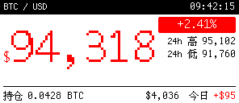</a></td>
    <td><a href="examples/desk/chart.json">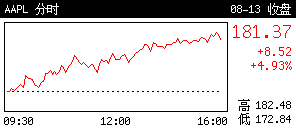</a></td>
  </tr>
  <tr>
    <td><a href="examples/desk/disk.json">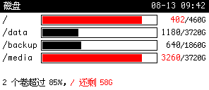</a></td>
    <td><a href="examples/desk/tasks.json">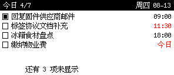</a></td>
  </tr>
  <tr>
    <td><a href="examples/layout_showcase/page.json">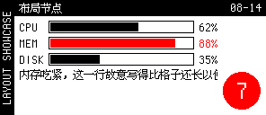</a></td>
    <td><a href="examples/compose_showcase/page.json">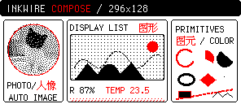</a></td>
  </tr>
  <tr>
    <td><a href="examples/card_showcase/page.json">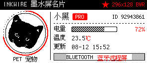</a></td>
    <td><a href="examples/showcase/page.json">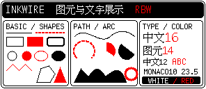</a></td>
  </tr>
  <tr>
    <td><a href="examples/paint_showcase/page.json">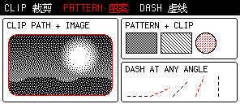</a></td>
    <td><a href="examples/state_showcase/page.json">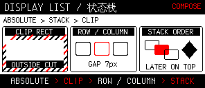</a></td>
  </tr>
  <tr>
    <td><a href="examples/text_showcase/page.json">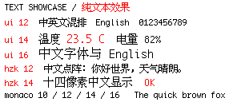</a></td>
    <td><a href="examples/fridge/page.json">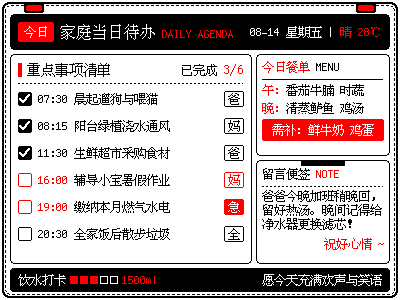</a></td>
  </tr>
</table>

## 参考

- https://github.com/atc1441/ATC_GICISKY_ESL —— 协议
- https://atc1441.github.io/ATC_GICISKY_Paper_Image_Upload.html —— 上传工具
- https://github.com/tinygo-org/bluetooth —— Go BLE
- https://github.com/fpoli/gicisky-tag —— Python
- https://github.com/eigger/hass-gicisky —— Home Assistant
- https://github.com/tsl0922/EPD-nRF5 —— EPD-nRF5 固件

[English](README.md)
