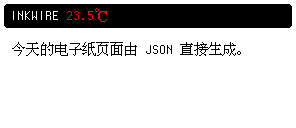

# Inkwire Scene Schema

`inkwire render`、`push` 与 `/v1/display` 所解码的文档。
运行 `inkwire schema` 可打印本文。[English](SCHEMA.md) · [README](README.zh-CN.md)

## Scene Schema

全部整数像素。

```json
{
  "version": 1,
  "orientation": "landscape",
  "background": "white",
  "root": {
    "type": "absolute",
    "clip": true,
    "children": [
      {
        "bounds": {"x": 4, "y": 4, "width": 288, "height": 24},
        "node": {
          "type": "rectangle",
          "radius": 4,
          "fill": "black"
        }
      },
      {
        "bounds": {"x": 10, "y": 8, "width": 276, "height": 16},
        "node": {
          "type": "text",
          "runs": [
            {"text": "INKWIRE ", "font": "monaco", "size": 12, "ink": "white"},
            {"text": "23.5℃", "font": "ui", "size": 14, "ink": "red"}
          ]
        }
      },
      {
        "bounds": {"x": 12, "y": 42, "width": 272, "height": 72},
        "node": {
          "type": "text",
          "wrap": "runes",
          "lineHeight": 16,
          "runs": [
            {"text": "今天的电子纸页面由 JSON 直接生成。", "font": "ui", "size": 14, "ink": "black"}
          ]
        }
      }
    ]
  }
}
```



### 页面

| 字段 | 类型 | 取值 | 默认 |
|---|---|---|---|
| `version` | integer | `1` | 必填 |
| `orientation` | string | `landscape`、`portraitClockwise`、`portraitCounterClockwise` | `landscape` |
| `size` | size | 仅预览 | 设备尺寸 |
| `background` | ink | `white`、`black`、`red`、`yellow` | `white` |
| `root` | node | | 空 |

渲染页面和解码后的源图片最多为 16,777,216 像素。

### 基本值

```json
{
  "size": {"width": 100, "height": 40},
  "point": {"x": 10, "y": 5},
  "rect": {"x": 10, "y": 5, "width": 100, "height": 40}
}
```

`ink` 为 `black`、`white`、`red` 或 `yellow`；可选颜色默认 `black`。

```json
{
  "ink": "black",
  "width": 2,
  "dash": [4, 2],
  "dashOffset": 0
}
```

| 字段 | 类型 | | 默认 |
|---|---|---|---|
| `ink` | ink | | `black` |
| `width` | integer | > `0` | 必填 |
| `dash` | integer[] | 实线/空白长度，每项 > `0` | 实线 |
| `dashOffset` | integer | | `0` |

所有节点需要 `type`。`size` 是流式布局的首选尺寸，在 `absolute.children[].bounds` 内被忽略。

### 长度

| 写法 | 含义 |
|---|---|
| `64` | 像素 |
| `"25%"` | 容器该轴尺寸的比例 |
| `"calc(100% - 12px)"` | 百分比 ± 像素，两项都必需 |

```json
{"basis": 64, "cross": "25%", "maxMain": "calc(100% - 12px)"}
```

`0` 是长度；字段缺省才是自动。`anchored` 上 `"right": 0` 贴边，不写 `right` 则该边自由。

距离接受负数——`anchored` 各边、`clipShape` 的 `inset`、`circle` 与 `ellipse` 的 `center`、`polygon` 的 `points`：

```json
{"left": -6, "right": "-10%", "top": "calc(0% - 6px)"}
```

尺寸不接受：`basis`、`cross`、`width`、`height`、`min*`/`max*`、轨道、`radius`、`corner`。百分比与 `fr` 不计入固有尺寸。

## 布局

### absolute

```json
{
  "type": "absolute",
  "clip": true,
  "children": [
    {
      "bounds": {"x": 4, "y": 4, "width": 100, "height": 20},
      "node": {"type": "rectangle", "fill": "black"}
    }
  ]
}
```

| 字段 | 类型 | | 默认 |
|---|---|---|---|
| `size` | size | | 内容 |
| `clip` | boolean | 裁到 bounds | `false` |
| `children[].bounds` | rect | | 必填 |
| `children[].node` | node | | 必填 |

### row / column

```json
{
  "type": "row",
  "gap": 4,
  "mainAlign": "start",
  "crossAlign": "center",
  "children": [
    {
      "basis": 64,
      "node": {"type": "text", "runs": [{"text": "LEFT"}]}
    },
    {
      "grow": 1,
      "node": {"type": "text", "align": "end", "runs": [{"text": "RIGHT"}]}
    }
  ]
}
```

| 字段 | 类型 | | 默认 |
|---|---|---|---|
| `gap` | integer | | `0` |
| `mainAlign` | string | `start`、`center`、`end` | `start` |
| `crossAlign` | string | `start`、`center`、`end`、`stretch` | `stretch` |
| `children[].grow` | integer | 剩余空间权重 | `0` |
| `children[].basis` | length | 分配前的主轴尺寸 | 内容 |
| `children[].cross` | length | 交叉轴尺寸 | 容器 |
| `children[].minMain` / `maxMain` | length | | 无 |
| `children[].minCross` / `maxCross` | length | | 无 |
| `children[].ratio` | number | 主轴 ÷ 交叉轴 | 无 |
| `children[].alignSelf` | string | 覆盖 `crossAlign` | 容器 |

### grid

```json
{
  "type": "grid",
  "columns": ["auto", "1fr", "auto"],
  "rows": [15, 15],
  "columnGap": 5,
  "rowGap": 3,
  "children": [
    {"node": {"type": "text", "runs": [{"text": "/data"}]}},
    {"node": {"type": "rectangle", "stroke": {"ink": "black", "width": 1}}},
    {"node": {"type": "text", "align": "end", "runs": [{"text": "1180G"}]}},
    {"column": 1, "columnSpan": 3, "node": {"type": "spacer"}}
  ]
}
```

| 字段 | 类型 | | 默认 |
|---|---|---|---|
| `columns` / `rows` | track[] | `"auto"`、长度、`"1fr"` | 一条自动轨道 |
| `columnGap` / `rowGap` | integer | | `0` |
| `alignItems` / `justifyItems` | string | `start`、`center`、`end`、`stretch` | `stretch` |
| `children[].column` / `row` | integer | 从 1 起的线号；`0` = 下一空位 | `0` |
| `children[].columnSpan` / `rowSpan` | integer | | `1` |
| `children[].alignSelf` / `justifySelf` | string | | 网格 |

自动轨道取最宽内容；`fr` 分配剩余。放置采用 CSS Grid 默认的稀疏行流：双轴明确定位的子节点可以重叠；只指定 `row` 的子节点在该行已满时创建隐式列；只指定 `column` 的子节点向下寻找；完全自动的子节点创建隐式行。隐式轨道均为自动轨道。

CLI 命令逐项打印扩展；HTTP 渲染响应在 JSON body 的
`report.GridExpansions` 中保留每个 grid 的完整记录。

### anchored

```json
{
  "type": "anchored",
  "children": [
    {"left": "50%", "top": 0, "width": 40, "height": 12,
     "node": {"type": "rectangle", "fill": "black"}},
    {"right": 0, "bottom": 0, "width": 20, "height": 20, "layer": 1,
     "node": {"type": "rectangle", "fill": "red"}}
  ]
}
```

| 字段 | 类型 | |
|---|---|---|
| `children[].top` `right` `bottom` `left` | length | 距该边的距离 |
| `children[].width` `height` | length | 该轴尺寸 |
| `children[].layer` | integer | 数值越高越晚绘制；相同时保持文档顺序 |
| `children[].node` | node | 内容 |

同轴两条边加一个尺寸被拒。

### transformed

```json
{
  "type": "transformed",
  "scale": 2,
  "turns": 1,
  "child": {"type": "text", "runs": [{"text": "42"}]}
}
```

| 字段 | 类型 | | 默认 |
|---|---|---|---|
| `scale` | integer | 仅整数 | `1` |
| `turns` | integer | 顺时针 90° 次数 | `0` |
| `child` | node | | 必填 |

需要重采样的一律拒绝。

### stack / padding / spacer

```json
{
  "type": "stack",
  "children": [
    {"type": "rectangle", "fill": "white", "stroke": {"ink": "black", "width": 1}},
    {"type": "text", "align": "center", "verticalAlign": "middle", "runs": [{"text": "OK"}]}
  ]
}
```

```json
{
  "type": "padding",
  "insets": {"top": 4, "right": 8, "bottom": 4, "left": 8},
  "child": {"type": "text", "runs": [{"text": "PAD"}]}
}
```

```json
{"type": "spacer", "size": {"width": 8, "height": 8}}
```

| 节点 | 字段 |
|---|---|
| `stack` | `size`、`children[]` —— 同一区域内按序绘制，后面的子节点在上层 |
| `padding` | `insets`（`top` `right` `bottom` `left`）、`child` |
| `spacer` | `size` |

## 文字

```json
{
  "type": "text",
  "align": "start",
  "verticalAlign": "top",
  "wrap": "none",
  "lineHeight": 14,
  "runs": [
    {"text": "温度 ", "font": "hzk", "size": 14, "ink": "black"},
    {"text": "23.5", "font": "monaco", "size": 14, "ink": "red"},
    {"text": "℃", "font": "hzk", "size": 14, "ink": "red"}
  ]
}
```

| 字段 | 类型 | | 默认 |
|---|---|---|---|
| `runs[].text` | string | | 必填 |
| `runs[].font` | string | `ui`、`hzk`、`monaco` | `ui` |
| `runs[].size` | integer | | `12` |
| `runs[].ink` | ink | | `black` |
| `align` | string | `start`、`center`、`end` | `start` |
| `verticalAlign` | string | `top`、`middle`、`bottom` | `top` |
| `wrap` | string | `none`、`runes` | `none` |
| `lineHeight` | integer | | 字体 |

| 字族 | 尺寸 | 覆盖 |
|---|---|---|
| `ui` | 12 14 16 24 28 32 36 42 48 | 拉丁 + 中日韩 |
| `hzk` | 12 14 16 24 28 32 36 42 48 | 拉丁 + 中日韩 |
| `monaco` | 10 12 14 16 20 24 28 30 32 36 42 48 | **仅 ASCII** |

16 以上为整数倍放大。混排拆成多个 run。

## 图片

```json
{
  "type": "image",
  "source": "portrait.png",
  "processing": "manual",
  "options": {
    "fit": "cover",
    "sampling": "bilinear",
    "dither": "floydSteinberg",
    "threshold": 128,
    "redThreshold": 170,
    "redMaxGreen": 170,
    "disableRed": false
  },
  "contrast": {
    "radius": 4,
    "amount": 1.3
  }
}
```

| 字段 | 类型 | | 默认 |
|---|---|---|---|
| `source` | string | 见[图片资源](README.zh-CN.md#图片资源) | 必填 |
| `processing` | string | `manual`、`auto` | `manual` |
| `options` | image options | 手动参数 | 默认值 |
| `overrides` | image overrides | 覆盖 `auto` 选出的指定字段 | 无 |
| `contrast.radius` | integer | 局部对比度半径，≥0 | 关闭 |
| `contrast.amount` | number | 局部对比度强度 | 关闭 |

options 与 overrides 字段相同；overrides 按字段生效。

| 字段 | 类型 | | 默认 |
|---|---|---|---|
| `fit` | string | `stretch`、`contain`、`cover` | `stretch` |
| `sampling` | string | `nearest`、`bilinear` | `nearest` |
| `dither` | string | `threshold`、`floydSteinberg`、`ordered` | `threshold` |
| `threshold` | integer | 0–255 亮度阈值 | `128` |
| `redThreshold` | integer | 0–255 红色通道阈值 | |
| `redMaxGreen` | integer | 0–255 判红的绿色上限 | |
| `disableRed` | boolean | 丢弃红色平面 | `false` |

`auto` 依据图像选择阈值、抖动与红色提取。`/v1/render` 和 `/v1/display` 在
`report.Images` 中返回决策，CLI 命令也会打印。成功的 `/v1/render` 固定返回
JSON，PNG 以 base64 `pngBase64` 与报告一起返回。

```json
{
  "type": "image",
  "source": "portrait.png",
  "processing": "auto",
  "overrides": {
    "fit": "cover",
    "sampling": "bilinear",
    "dither": "floydSteinberg",
    "disableRed": true
  },
  "contrast": {
    "radius": 4,
    "amount": 1.3
  }
}
```

```json
{
  "type": "image",
  "source": "data:image/png;base64,iVBORw0KGgoAAA...",
  "processing": "manual"
}
```

## 图元

区域来自 `absolute` 的 bounds 或共享的 `stack`。

| `type` | 字段 | 可选 |
|---|---|---|
| `pixel` | `at`、`ink` | `size` |
| `rectangle` | `fill` 或 `stroke` | `size`、`radius` |
| `line` | `from`、`to`、`stroke` | `size` |
| `polyline` | `points` ≥2、`stroke` | `size` |
| `polygon` | `points` ≥3、`fill` 或 `stroke` | `size` |
| `circle` | `center`、`radius`、`fill` 或 `stroke` | `size` |
| `ellipse` | `fill` 或 `stroke` | `size` |
| `arc` | `start`、`sweep`、`stroke` | `size` |
| `pie` | `start`、`sweep`、`ink` | `size` |
| `chord` | `start`、`sweep`、`ink` | `size` |

角度为度。`ellipse` `arc` `pie` `chord` 使用整个矩形。

```json
{
  "type": "absolute",
  "children": [
    {
      "bounds": {"x": 2, "y": 2, "width": 40, "height": 24},
      "node": {"type": "rectangle", "radius": 4, "fill": "white", "stroke": {"ink": "black", "width": 1}}
    },
    {
      "bounds": {"x": 46, "y": 2, "width": 32, "height": 32},
      "node": {"type": "circle", "center": {"x": 16, "y": 16}, "radius": 14, "stroke": {"ink": "red", "width": 2}}
    },
    {
      "bounds": {"x": 82, "y": 2, "width": 40, "height": 24},
      "node": {"type": "ellipse", "fill": "red", "stroke": {"ink": "black", "width": 1}}
    },
    {
      "bounds": {"x": 126, "y": 2, "width": 40, "height": 24},
      "node": {"type": "arc", "start": -90, "sweep": 270, "stroke": {"ink": "black", "width": 3}}
    },
    {
      "bounds": {"x": 170, "y": 2, "width": 40, "height": 24},
      "node": {"type": "pie", "start": -90, "sweep": 120, "ink": "red"}
    },
    {
      "bounds": {"x": 214, "y": 2, "width": 40, "height": 24},
      "node": {"type": "chord", "start": 20, "sweep": 220, "ink": "black"}
    }
  ]
}
```

```json
{
  "type": "stack",
  "children": [
    {"type": "pixel", "at": {"x": 3, "y": 3}, "ink": "black"},
    {"type": "line", "from": {"x": 0, "y": 20}, "to": {"x": 60, "y": 0}, "stroke": {"ink": "red", "width": 2, "dash": [4, 2]}},
    {"type": "polyline", "points": [{"x": 0, "y": 8}, {"x": 6, "y": 2}, {"x": 12, "y": 8}], "stroke": {"ink": "black", "width": 1}},
    {"type": "polygon", "points": [{"x": 20, "y": 0}, {"x": 40, "y": 10}, {"x": 20, "y": 20}, {"x": 0, "y": 10}], "fill": "red"}
  ]
}
```

## Path

```json
{
  "type": "path",
  "commands": [
    {"op": "move", "to": {"x": 0, "y": 20}},
    {"op": "line", "to": {"x": 20, "y": 0}},
    {"op": "quadratic", "control": {"x": 30, "y": 20}, "to": {"x": 40, "y": 5}},
    {"op": "cubic", "control1": {"x": 45, "y": 0}, "control2": {"x": 50, "y": 20}, "to": {"x": 60, "y": 10}},
    {"op": "arc", "bounds": {"x": 60, "y": 0, "width": 30, "height": 30}, "start": 0, "sweep": 180},
    {"op": "close"}
  ],
  "fill": "black",
  "stroke": {"ink": "red", "width": 1}
}
```

| `op` | 字段 |
|---|---|
| `move` | `to` |
| `line` | `to` |
| `quadratic` | `control`、`to` |
| `cubic` | `control1`、`control2`、`to` |
| `arc` | `bounds`、`start`、`sweep` |
| `close` | |

≥1 条命令，且需 `fill` 或 `stroke`。

## Pattern

```json
{
  "type": "pattern",
  "rows": [
    "x...",
    ".r..",
    "..x.",
    "...r"
  ],
  "inks": {
    "x": "black",
    "r": "red"
  }
}
```

各行等长。`inks` 键为单字符；未映射字符不修改画面。在区域内平铺。

## 裁剪

| 节点 | 裁到 |
|---|---|
| `clip` | 子节点自身的框 |
| `clipRect` | 一个矩形 |
| `clipShape` | `inset`、`circle`、`ellipse`、`polygon` |
| `clipPath` | 一条路径 |

| 节点 | 字段 |
|---|---|
| `clip` | `size`、`child` |
| `clipRect` | `size`、`rect`、`child` |
| `clipShape` | `size`、`shape`、`child` |
| `clipPath` | `size`、`path`、`child`（命令位于 `path.commands`） |

`shape.kind` 为 `inset`、`circle`、`ellipse` 或 `polygon`，按需带 `insets`、`corner`、`radius`、`radiusX`、`radiusY`、`center`、`points`。裁剪节点自身不决定绘制顺序：每个节点只有一个子节点，嵌套裁剪取交集。有重叠的同级裁剪可放入 `stack`（后面的子节点在上层）；若还需要定位框，使用 `anchored.children[].layer`。

```json
{"type": "clip", "child": {"type": "text", "runs": [{"text": "很长的一行"}]}}
```

```json
{
  "type": "clipRect",
  "rect": {"x": 0, "y": 0, "width": 80, "height": 40},
  "child": {"type": "rectangle", "fill": "red"}
}
```

```json
{
  "type": "clipShape",
  "shape": {"kind": "circle", "radius": "50%"},
  "child": {"type": "image", "source": "portrait.png", "processing": "auto"}
}
```

```json
{
  "type": "clipPath",
  "path": {
    "commands": [
      {"op": "arc", "bounds": {"x": 0, "y": 0, "width": 64, "height": 64}, "start": 0, "sweep": 360},
      {"op": "close"}
    ]
  },
  "child": {
    "type": "image",
    "source": "portrait.png",
    "processing": "auto",
    "overrides": {"fit": "cover", "disableRed": true}
  }
}
```
